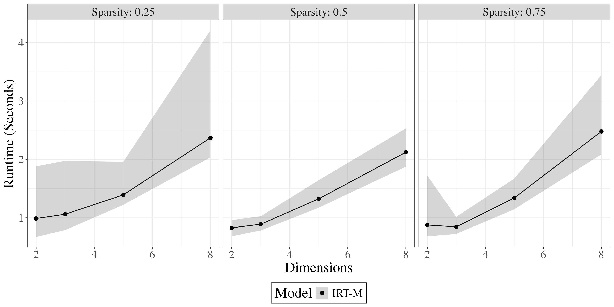

## Introduction

This repository hosts R code to compare the IRT-M dimensionality reduction algorithm with the closest similar algorithm, Bayesian Confirmatory Factor Analysis (BCFA) and Bayesian Structural Topic Modeling (BSEM).

There are a number of helper scripts, to facilitate simulating data for us in BCFA and BSEM models.

As of late November 2024, the simulation design has three components:

1) Broad survey of IRT-M vs BCFA and BSEM, for 10 runs across a wide range of parameter specifications.

Results TBD.
   
2) In-depth analysis of IRT-M vs BCFA and BSEM for a range of models with a baseline specification in which BCFA and BSEM tend to perform well.
These models compare each algorithm on simulated datasets with N = 100 units, K = 10 features, high loading sparsity (.75% of possible loadings zeroed out), and 2, 4, 6, and 8 underlying dimensions. It does 50 iterations for each combination of parameters.

3) Analysis of how each algorithm performs with more or less sparse models.

Across the specifications, IRT-M:

- Has a lower error rate

- Has lower failure rates

- Runs faster

